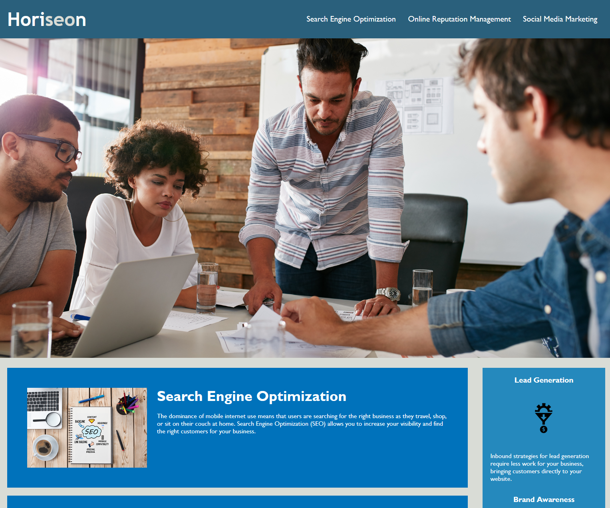
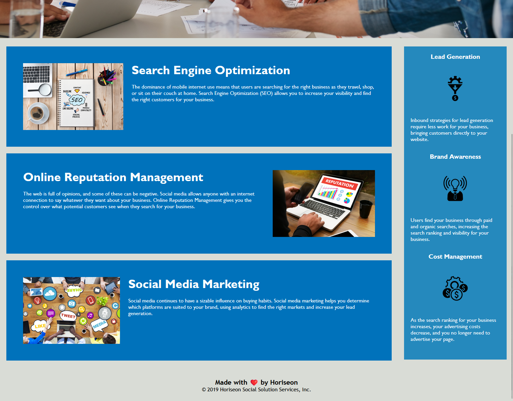

# Horiseon Code Refactored 

## Description

Refactored HTML and CSS for a web development website with the goal to make the page / code more accessible. Fixed links, added alt text to images, and consolidated CSS classes.

## Table of Contents

- [Usage](#usage)
- [License](#license)

## Usage

To view the website, visit https://jubernst.github.io/code-refactor/

Website screenshots:

## License

This work is available under the [MIT License](https://opensource.org/licenses/MIT).
